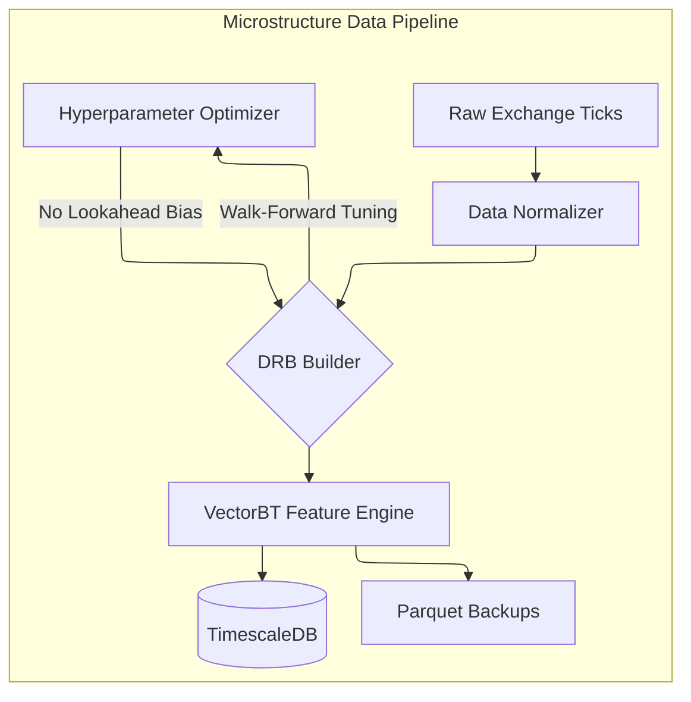

# information-bars

> Open-source crypto microstructure pipeline — from raw exchange ticks to ML-ready datasets.

[](LICENSE)
[](https://www.python.org/)
[](https://vectorbt.io/)

`information-bars` discards chronological sampling (1m/1h candles) in favor of **Dollar Run Bars (DRBs)** — information-driven bars that sample markets based on volume flow rather than the clock. The result is a time series that aims to reduce the heteroscedasticity that makes raw crypto data difficult to model.

The pipeline covers the full journey: tick ingestion → DRB construction → walk-forward hyperparameter optimization → feature engineering → Parquet export.

---

## How it works



| Stage | What it does |
| :--- | :--- |
| **Tick ingestion** | Downloads historical tick data directly from Binance. |
| **Normalization** | MAD outlier filter, missing data handling, tick standardization. |
| **DRB construction** | Converts ticks into Dynamic Dollar Run Bars driven by market flow. |
| **Walk-forward optimization** | Finds optimal `exp_lambda` and `init_exp_T` per month without lookahead bias. |
| **Feature engineering** | Calculates 15 engineered features via VectorBT (14 bar-level + 1 positioning). |
| **TimescaleDB** | Centralizes bars + hyperparams in a time-series database for easy querying. |
| **Parquet export** | Saves ML-ready datasets as local backup with sample weights and metadata. |

---

## Quick Start

### Quick Start (no exchange or database required)

The synthetic example verifies the complete local path from ticks to DRBs and
features. It is the recommended first command for contributors and users.

```bash
git clone https://github.com/Camgomocod/information_bars.git
cd information_bars

python -m venv .venv
source .venv/bin/activate
python -m pip install -e ".[dev]"

trading-core-healthcheck --offline
trading-core-synthetic
```

The example writes `data_optimized/examples/synthetic_drb_features.parquet`.
It does not require Binance credentials, historical data, Optuna studies,
TimescaleDB, or a GPU.

Advanced users can point an installed package at a custom YAML configuration
directory with `TRADING_CORE_CONFIG_DIR=/path/to/config`.

### Conda / Mamba (optional)

```bash
micromamba env create -f environment.yml
micromamba activate trading-core

trading-core-healthcheck --offline
trading-core-synthetic
```

### pip

```bash
pip install -r requirements.txt
trading-core-healthcheck --offline
trading-core-synthetic
```

### Docker

```bash
docker build -t information-bars .
docker run --rm -it information-bars trading-core-synthetic
```

The Docker image contains the software only. Mount raw data and output
directories explicitly when running the exchange-data workflows.

---

## Full Pipeline

### Step 1 — Hyperparameter Optimization

Find optimal DRB parameters for each month via Bayesian walk-forward optimization:

```bash
# Single month
python optimization/tune_multiasset_hyperparams.py --year 2024 --month 01 --trials 50

# Full year (recommended)
python scripts/run_year_optimization.py --year 2024 --trials 50

# Partial window for current month (e.g., Apr + May-to-date)
python scripts/run_year_optimization.py --year 2026 --start-window 3 \
    --allow-partial --cutoff-date 2026-05-20
```

Output: study metadata in TimescaleDB. Local `.pkl` files are optional offline
artifacts for inspection and migration only.

### Download Raw Data

```bash
# Full year
python scripts/download_raw_ticks.py --symbols BTCUSDT ETHUSDT --year 2026

# Specific month
python scripts/download_raw_ticks.py --symbols BTCUSDT ETHUSDT --year 2026 --month 01

# Resume missing days only (dry-run shows gaps)
python scripts/download_raw_ticks.py --symbols BTCUSDT ETHUSDT --year 2026 --month 01 --dry-run

# Specific days
python scripts/download_specific_days.py --symbol BTCUSDT --dates 2026-01-15 2026-01-20
```

Historical downloads require substantial disk space and are subject to the
exchange's terms. The downloaded files are intentionally not included in this
repository.

Install database support only when needed:

```bash
python -m pip install -e ".[db]"
```

### Process Specific Days

Process individual days through the full DRB pipeline with failed-day recovery:

```bash
python scripts/process_specific_days.py --symbol BTCUSDT --dates 2026-01-15

python scripts/process_specific_days.py --symbols BTCUSDT ETHUSDT --dates 2026-01-15 2026-01-20 \
    --trials 50 --no-positioning
```

### Step 2 — Build Yearly Training Data

Generates per-year Parquet files with integrated failed-day recovery:

```bash
# Single year
python scripts/build_yearly_training_data.py --year 2023 --symbols BTCUSDT

# Multiple symbols
python scripts/build_yearly_training_data.py --year 2023 --symbols BTCUSDT ETHUSDT SOLUSDT

# Range of years
python scripts/build_yearly_training_data.py --start-year 2023 --end-year 2025

# Use pre-downloaded data (skips re-download)
python scripts/build_yearly_training_data.py --year 2023 --symbols BTCUSDT --source auto --data-dir data_raw

# Lower memory usage
python scripts/build_yearly_training_data.py --year 2023 --symbols BTCUSDT --chunk-size 1

# Append only missing days for a month (incremental)
python scripts/build_yearly_training_data.py --append-missing-month 2026-05 --symbols BTCUSDT --source auto

# Append only missing days in a date range
python scripts/build_yearly_training_data.py --append-missing-range 2026-05-01 2026-05-20 \
    --symbols BTCUSDT --source auto
```

Output:

```
data_optimized/training/
├── 2023/
│   ├── BTCUSDT_2023.parquet
│   └── ETHUSDT_2023.parquet
├── 2024/
│   └── ...
```

Each Parquet includes:

| Column | Description |
|--------|-------------|
| `failed_day` | `1` if the bar's date required recovery, `0` otherwise |
| `sample_weight` | `1.0` normal bars · `0.5` irrecoverable failed bars |
| `study_source` | Name of the Optuna study used (e.g. `bayesian_2023_01_w2m`) |
| `completion_rate` | Success rate of the study used |

### Step 3 — Daily Inference Pipeline (VPS Deploy)

Separate pipeline for production trading. Guarantees at least 1 bar with real price data per trading day:

```bash
# First run: seed from training data
python scripts/process_yesterday.py --symbols BTCUSDT ETHUSDT SOLUSDT --bootstrap

# Daily cron (1 AM UTC)
micromamba run -n trading-core python scripts/process_yesterday.py \
    --symbols BTCUSDT ETHUSDT SOLUSDT --source binance --new-month optimize
```

**Fallback chain** (guarantees output for every trading day):
1. **Walk-forward params** → DRBs (if ≥ 40 bars → done)
2. **Symbol defaults** → DRBs (conservative params, wider bars)
3. **Mini-Optuna** (20 trials, 60s) → DRBs (finds params for this specific day)
4. **Aggregated OHLCV bar** → 1 bar from raw ticks (last resort, real prices)

Output: `data_optimized/inference/{SYMBOL}_latest.parquet` (rotating 300 bars)

> **Strict separation**: Training data is NEVER mixed with inference data. Training uses monthly batch processing with per-month MAD filters; inference uses daily processing with per-day MAD filters.

---

## Walk-Forward Parameter Logic

The `DBReader` enforces strict no-lookahead: for month **M**, it loads the most recent study whose period ends **strictly before M** from TimescaleDB. Legacy offline scripts may still read `.pkl` studies through `HyperparamLoader` during migration.

- Naming: `bayesian_YYYY_MM_w2m` covers 2 months ending at `YYYY-MM`
- Example: `bayesian_2023_01_w2m` → used for Feb/Mar 2023, never for Jan 2023
- Per-symbol fallback defaults are defined in `src/storage/db_reader.py`

```python
from src.storage.db_reader import DBReader

reader = DBReader()
params = reader.get_params("BTCUSDT", 2024, 6)
# → {"exp_lambda": 0.9647, "init_exp_t": 1746, "source": "bayesian_2024_05_w2m"}
```

### Failed-Day Recovery

Days producing fewer than 50 bars are marked as failed and automatically recovered:

1. Detect days below threshold
2. Run targeted Bayesian optimization for those days
3. Reprocess with recovered parameters
4. If still failing: mark `sample_weight = 0.5`

Recovery rates for BTCUSDT: 87% (2023) · 100% (2024) · 100% (2025)

---

## Data Quality

Run integrity checks on any generated Parquet:

```bash
python tests/test_data_integrity.py --years 2023 2024 --symbols BTCUSDT
```

Checks include: file size, column presence, date coverage, NaN values, OHLCV consistency, duplicate timestamps, bar counts, and feature value ranges.

## TimescaleDB Integration

Production bars and hyperparameters are centralized in TimescaleDB. Parquet and
Optuna `.pkl` files are migration/offline backups, not the production source of truth.

TimescaleDB is optional. It is not needed for DRB generation, feature
calculation, the synthetic example, or local Parquet workflows.

```bash
# Start the database
docker-compose up -d

# Migrate existing parquets (one-time)
python scripts/migrate_to_timescale.py

# Query from any layer
python -c "
from src.storage.db_reader import DBReader
reader = DBReader()
df = reader.get_bars('BTCUSDT', '2023-01-01', '2024-06-30')
params = reader.get_params('BTCUSDT', 2024, 6)
"
```

| Table | Type | Purpose |
|-------|------|---------|
| `bars` | Hypertable | Training data (DRB + features) |
| `studies` | Normal | Hyperparameter optimization metadata |
| `failed_days` | Normal | Failed days per study |
| `positioning` | Normal | Binance Futures funding rates |

### Dataset Statistics

| Year | Symbol | Bars | Failed % | Size |
|------|--------|------|----------|------|
| 2020 | BTCUSDT | 247,898 | 0.1% | 32.7 MB |
| 2021 | BTCUSDT | 313,567 | 0.0% | 40.2 MB |
| 2021 | BNBUSDT | 324,157 | 0.0% | 39.1 MB |
| 2021 | SOLUSDT | 157,208 | 0.1% | 21.4 MB |
| 2022 | BTCUSDT | 723,383 | 0.0% | 78.6 MB |
| 2022 | BNBUSDT | 180,243 | 0.0% | 19.9 MB |
| 2022 | SOLUSDT | 202,244 | 0.0% | 24.3 MB |
| 2023 | BTCUSDT | 115,733 | 0.0% | 12.8 MB |
| 2023 | BNBUSDT | 115,798 | 0.0% | 12.8 MB |
| 2023 | SOLUSDT | 164,223 | 0.0% | 19.0 MB |
| 2024 | BTCUSDT | 149,385 | 0.0% | 17.3 MB |
| 2024 | BNBUSDT | 149,385 | 0.0% | 17.3 MB |
| 2024 | SOLUSDT | 317,663 | 0.0% | 35.4 MB |
| 2025 | BTCUSDT | 119,050 | 0.0% | 15.6 MB |
| 2025 | BNBUSDT | 119,050 | 0.0% | 15.6 MB |
| 2025 | SOLUSDT | 113,849 | 0.0% | 14.5 MB |

> **Note:** ~0.2–0.5% of bars share timestamps with different OHLCV values. This is expected — it comes from aggregating multiple trades at the same millisecond and is acceptable for ML training.

---

## Project Structure

```
information_bars/
├── config/                          # YAML configuration
│   ├── bars_config.yaml             # DRB parameters & quality thresholds
│   ├── exchanges.yaml               # Exchange connectivity
│   ├── features_config.yaml         # Feature extraction rules
│   └── symbols.yaml                 # Trading pairs
│
├── src/
│   ├── bars/                        # Information sampling algorithms
│   ├── connectors/                  # Binance tick downloader
│   ├── features/                    # VectorBT feature calculators
│   ├── normalizers/                 # MAD filter & fractional differentiation
│   ├── pipeline/                    # Bar builder + daily inference processor + mini-optimizer
│   ├── storage/                     # TimescaleDB client + reader + schema
│   └── config.py
│
├── scripts/                         # Pipeline entry points
│   ├── build_training_data.py       # Batch training pipeline (monthly)
│   ├── build_yearly_training_data.py # Yearly training with chunking
│   ├── process_yesterday.py         # Daily inference pipeline (VPS cron)
│   └── ...
├── optimization/                    # Bayesian hyperparameter tuning (Optuna)
├── tests/                           # Test suite (pytest)
├── docker-compose.yml               # TimescaleDB local instance
├── data_optimized/
│   ├── training/                    # Training Parquet datasets (batch, backup)
│   └── inference/                   # Inference Parquet files (daily, rotating 300 bars)
├── data_raw/                        # Raw tick data
└── DATA_SPEC.md                     # Column reference & feature formulas
```

---

## Tests

```bash
# Full suite
python -m pytest tests/ -v

# Data integrity
python tests/test_data_integrity.py --years 2023 2024 2025

# Unit tests (no DB / network / data files required)
python -m pytest tests -m "not db and not slow" -q

# Fast public smoke test
python -m pytest tests -m "not db and not slow" -q

# TimescaleDB pipeline (requires running DB)
python tests/test_db_pipeline.py
```

---

## References

- López de Prado, M. (2018). *Advances in Financial Machine Learning* — Ch. 2 (Information Bars), Ch. 7 (Walk-Forward CV)
- [VectorBT](https://vectorbt.io/)

---

## License

MIT — see [LICENSE](LICENSE).

If you use this project in research, please cite it using [CITATION.cff](CITATION.cff).

---

*Built for the crypto quantitative research community.*
